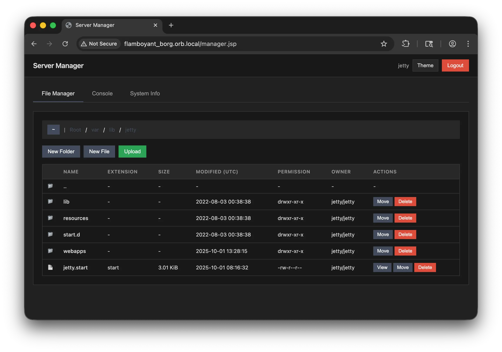

# JSP Server Manager

A lightweight, single-file web-based server management interface built with JSP. Provides file management, command execution, and system monitoring capabilities with optional end-to-end encryption.

## Description

JSP Server Manager is a self-contained server administration tool that runs on any Java servlet container (Tomcat, Jetty, etc.). The entire application is contained in a single JSP file, making deployment as simple as dropping it into your webapp directory.


## Features

### File Management
- **Browse & Navigate** - Filesystem navigation
- **File Operations** - Create, delete, move/rename files and directories
- **View & Edit** - Read and modify file contents with syntax highlighting
- **Upload** - Multipart file upload with drag-and-drop support
- **Permissions** - View and modify POSIX file permissions

### Console
- **Command Execution** - Execute system commands directly from the web interface
- **Command History** - Persistent command history within session
- **Quick Commands** - One-click shortcuts for common commands (pwd, whoami, ls, etc.)
- **Output Display** - Color-coded console output with error highlighting

### System Information
- **OS Details** - Operating system name, version, and architecture
- **Java Environment** - JVM version, vendor, and paths
- **Memory Usage** - Real-time memory consumption and availability
- **Disk Space** - Storage capacity and usage for all mounted drives
- **User Information** - Current user, home directory, and working directory

### Security Features
- **Authentication** - Password-protected access
- **Optional Encryption** - POST parameter encryption for all requests
  - AES-128-CBC encryption with random IV per request
  - Pure JavaScript implementation (no dependencies)
  - Supports base64, base32, and hex encoding
  - Encrypts form fields, file upload metadata, AJAX requests
  - Client-side key storage in LocalStorage
- **Password Hashing** - SHA-512 password hashing for stored credentials
- **Session Management** - Configurable session expiry (7 days default)

### Technical Features
- **Single File** - Entire application in one JSP file (~2,200 lines)
- **No Dependencies** - Pure Java and JavaScript, no external libraries
- **Works Anywhere** - Compatible with any servlet container
- **Pure JS Crypto** - Full SHA-256 and AES implementation in JavaScript
- **Cross-Browser** - Works in all modern browsers

## Screenshots





## Installation

1. **Download** the `manager.jsp` file
2. **Place** it in your servlet container's webapp directory
   - Tomcat: `webapps/ROOT/` or `webapps/yourapp/`
   - Jetty: `webapps/` or `contexts/`
3. **Access** via browser: `http://your-server:port/manager.jsp`
4. **Login** with default password: `admin123`

## Configuration

Edit the configuration section at the top of `manager.jsp`:

```java
// Authentication
private static final String AUTH_PASSWORD_HASH = "7fcf4ba391..."; // SHA-512 hash
private static final String AUTH_COOKIE_NAME = "SM_AUTH";
private static final int AUTH_COOKIE_EXPIRY_DAYS = 7;

// Encryption (optional)
private static final boolean PARAM_ENCRYPTION_ENABLED = false;
private static final String ENCRYPTION_KEY = "MySecretKey12345";
private static final String ENCRYPTION_ALGORITHM = "AES";
private static final String ENCRYPTION_ENCODING = "base64"; // or "base32", "hex"
```

### Changing Password

Generate a new SHA-512 hash of your password:
```bash
echo -n "yourpassword" | sha512sum
```

Replace the `AUTH_PASSWORD_HASH` value with the generated hash.

### Enabling Encryption

Set `PARAM_ENCRYPTION_ENABLED = true` and configure a strong encryption key:
```java
private static final boolean PARAM_ENCRYPTION_ENABLED = true;
private static final String ENCRYPTION_KEY = "YourSecretKey123!@#";
```

**Note:** Encryption: all POST parameters (not including file upload data in multipart requests) will be encrypted client-side before transmission.

## Requirements

- **Java Servlet Container** - Tomcat 8+, Jetty 9+, or compatible
- **Java Runtime** - JRE 8 or higher
- **Modern Browser** - Chrome, Firefox, Safari, Edge (ES6+ support)

## Browser Compatibility

- ✅ Chrome/Edge 60+
- ✅ Firefox 55+
- ✅ Safari 11+
- ✅ Opera 47+
- ⚠️ Internet Explorer - Not supported (requires ES6)

## Troubleshooting

### Login Issues
- Verify password hash is correct (SHA-512)
- Clear browser cookies and Local Storage for the site
- Check servlet logs

### File Upload Issues
- Check `MAX_UPLOAD_SIZE` configuration
- Verify servlet upload limits
- Ensure target directory has write permissions

## Contributing

Contributions are welcome! Areas for improvement:
- Additional file operations (copy, archive, extract)
- Process management interface
- Network monitoring tools
- Log file viewer
- Database management tools

## License

MIT License


## Disclaimer

Use responsibly and only on systems you own or have explicit permission to manage. The authors are not responsible for any misuse or damage caused by this software.
